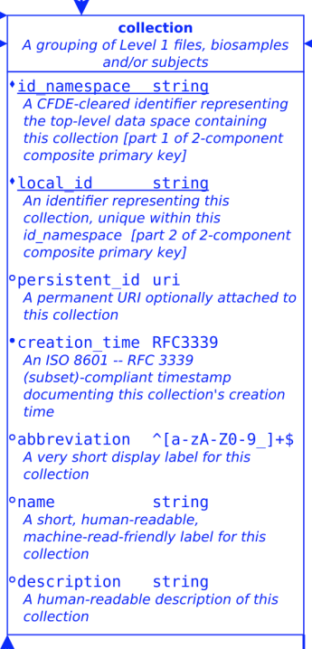
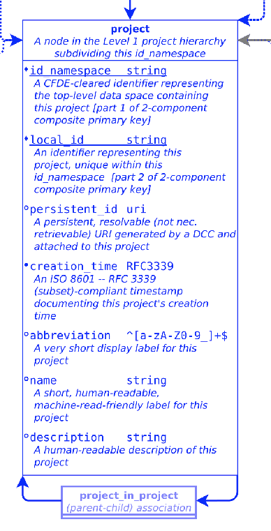
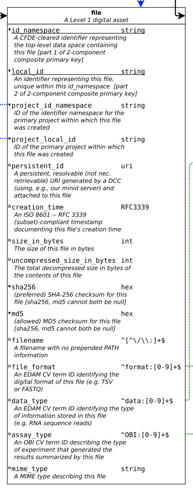

# About the model
At the moment, we need to generate 3 TSV files to meet the minimum requirements from CFDE

## collection.tsv


## project.tsv


## file.tsv


# Install submission package

## cfde-submit

```
pip install cfde-submit
```

# TODO

* TODO
